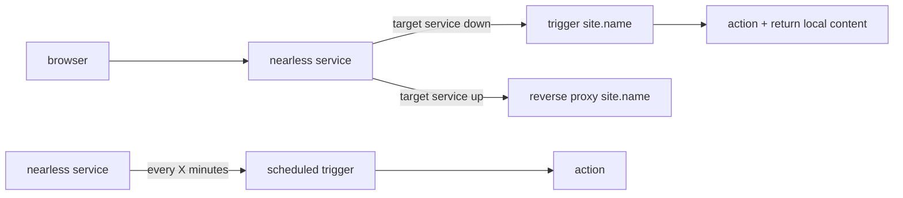
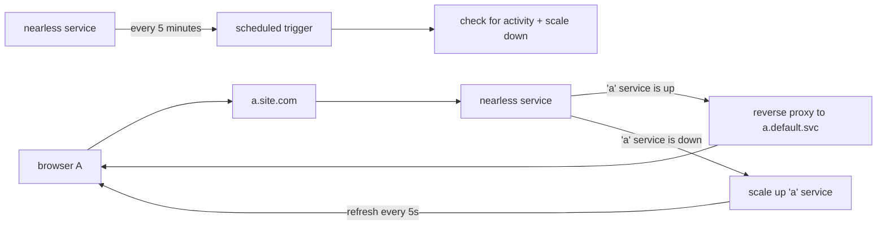
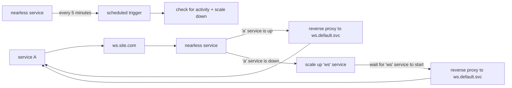

# nearless

_tbc_

## Image security scans

[](.github/sec-build.md)<br>

## Concepts

### Generic



---

### Example for a site



### Example for a web service



---

## Configuration

### Defining triggers

On the triggers.yaml there should be:

| Job | Description |
|-----|-------------|
| Prepare scheduled trigger | Should be defined as a 'periodic' oJob running on a crontab expression or time interval. |
| Trigger [source host] | One or more job definitions triggered everytime the included nginx reverse proxy finds the primary target service down. |
| Trigger [type] | One or more generic, per host type, job definitions triggered everytime the included nginx reverse proxy finds the primary targets down (the specific source host will be provided to the job as _args.\_host_)

> Your triggers.yaml implementation should be provided as a config map on /ojob/triggers.yaml

```yaml
# ------------------
- name: Prepare init
  exec: |
    // prepare and initialize global structures

# -------------------------------
- name: Prepare scheduled trigger
  type: periodic
  typeArgs:
    # every minute
    cron: "*/1 * * * *"
  exec: |
    // code to check if wiki:80 can be scale down (eventually to 0)
    // code to check if chat:80 can be scale down (eventually to 0)

# ----------------------
- name: Trigger wiki.com
  exec: |
    // The target wiki:80 is down (scale = 0) but a browser made a request to it; code to scale up
    // Return generated HTML content to refresh page in 5 seconds

# ----------------------
- name: Trigger chat.com
  exec: |
    // The target chat:80 is down (scale = 0) but a service made a request to it; code to scale up
    // Wait for service to be up
    // Make the same request to the chat service and return the answer

# --------------------
- name: Trigger type-a
  exec: |
    // Any target whose type is 'type-a' that is down (scale = 0) but a service made a request to it; code to scale up
    // Wait for service to be up
    // Make the same request to the chat service and return the answer

```

### Defining sources & targets

As an environment variable 'sites' should be defined as a [SLON](https://github.com/nmaguiar/slon) or JSON array of maps where each map is composed of:

| Element | Type | Description |
|---------|------|-------------|
| name | String | A reference name of a site |
| source | String | The incoming 'host' address excluding ports (e.g. a.site.com) |
| target | String/Array | The internal kubernetes or docker target service/container (e.g. site-portal.my-namespace.com:8080) or an array of maps with 'path' (original string URI), 'to' (target service/container) and 'rewrite' (boolean that if true will remove the 'path' from the URI) |
| type | String | The type of site to use generic triggers |
| direct | Boolean | If true the proxied HTTP header fields won't be used (defaults to false) |

Example:

```yaml
env:
- name : sites
  value: "[(name: wiki, source: wiki.com, target: 'wiki:80', type: wikipedia)|(name: chat, source: chat.com, target: [(path: /, to: 'chat:80')|(path: /keycloak, to: 'sso:80', rewrite: true)] )]"
```

## Testing

### Basic

Success reverse proxy test:

```
docker run --rm -ti -p 8080:8080 -e sites="[(name: oaf, source: openaf.io, target: 'openaf.io')]" nmaguiar/nearless:build
```

Fallback reverse proxy test:

```
docker run --rm -ti -p 8080:8080 -e sites="[(name: oaf, source: openaf.io, target: 'openaf.io:444')]" nmaguiar/nearless:build
```

### By type

Success reverse proxy test:

```
docker run --rm -ti -p 8080:8080 -e sites="[(name: oaf, source: openaf.io, target: 'openaf.io', type: anysite)]" nmaguiar/nearless:build
```

Fallback reverse proxy test:

```
docker run --rm -ti -p 8080:8080 -e sites="[(name: oaf, source: openaf.io, target: 'openaf.io:444', type: anysite)]" nmaguiar/nearless:build
```