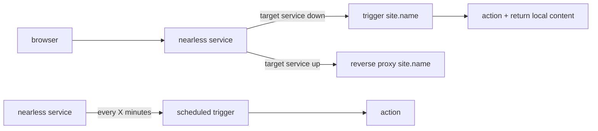
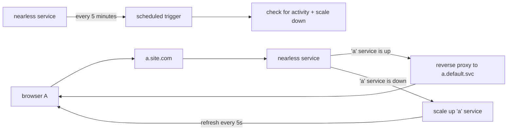

# nearless

_tbc_

## Image security scans

[](.github/sec-build.md)<br>

## Concepts

### Generic



---

### Example



---

## Configuration

### Defining triggers

On the triggers.yaml there should be:

| Job | Description |
|-----|-------------|
| Prepare scheduled trigger | Should be defined as a 'periodic' oJob running on a crontab expression or time interval. |
| Trigger [source host] | One or more job definitions triggered everytime the included nginx reverse proxy finds the primary target service down. |

> Your triggers.yaml implementation should be provided as a config map on /ojob/triggers.yaml

### Defining sources & targets

As an environment variable 'sites' should be defined as a [SLON](https://github.com/nmaguiar/slon) or JSON array of maps where each map is composed of:

| Element | Type | Description |
|---------|------|-------------|
| name | String | A reference name of a site |
| source | String | The incoming 'host' address excluding ports (e.g. a.site.com) |
| target | String | The internal kubernetes or docker target service/container (e.g. site-portal.my-namespace.com:8080) |

Example:

```yaml
env:
- name : sites
  value: "[(name: wiki, source: wiki.com, target: 'wiki:80')|(name: chat, source: chat.com, target: 'chat:80')]"
```